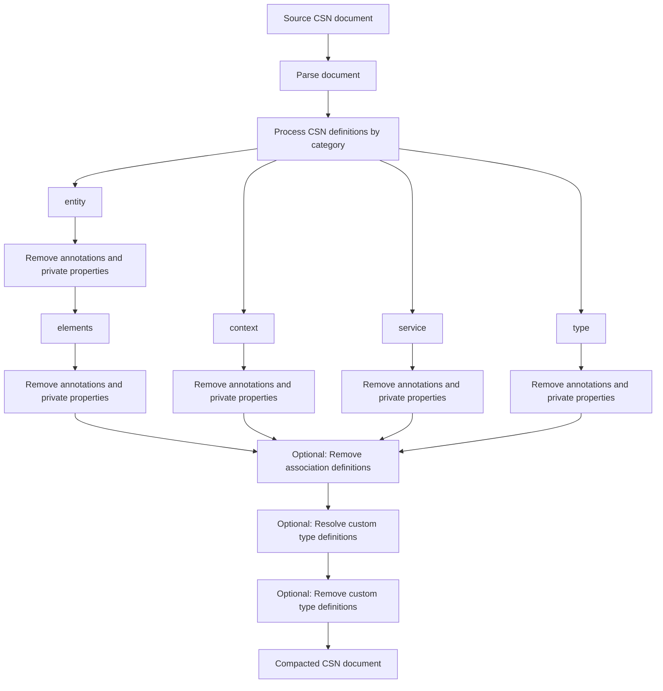

[](https://api.reuse.software/info/github.com/open-resource-discovery/metadata-compactor-golang)
[](https://github.com/open-resource-discovery/metadata-compactor-golang/actions/workflows/ci.yml)
[](https://github.com/open-resource-discovery/metadata-compactor-golang/releases/latest)

# Metadata Compactor Golang Library

Compact [Core Schema Notation](https://sap.github.io/csn-interop-specification/) JSON documents for AI-friendly metadata exposure. Rulesets control which annotations and private properties remain, and whether custom types and association elements are preserved.



## Requirements and Setup

Requires Go 1.26 or later.

### Installation

```sh
go get github.com/open-resource-discovery/metadata-compactor-golang
```

## Build

Build the command-line tool from the repository root:

```sh
go build -o metadata-compactor ./cmd/metadata-compactor
```

This creates a `metadata-compactor` executable in the current directory.

## Usage

```text
metadata-compactor -i <input.json> -r <rules.json> [-o <output.json>]
```

| Flag | Required | Description                                                                         |
| --- | --- |-------------------------------------------------------------------------------------|
| `-i` | Yes | Path to the CSN JSON document to compact.                                           |
| `-r` | Yes | Path to the JSON rules file.                                                        |
| `-o` | No | Path for the compacted CSN. When omitted, the result is written to standard output. |

For example, write the compacted document to a file:

```sh
./metadata-compactor -i input.airline.csn.json -r rules.json -o compacted.airline.csn.json
```

Or send it directly to another command:

```sh
./metadata-compactor -i input.airline.csn.json -r rules.json | jq .
```

### Running the tests

Run vet:

```sh
go vet -tags unit,integration ./...
```

Run tests:

```sh
# Run unit tests only
go test -tags unit ./...

# Run integration tests only
go test -tags integration ./...

# Run unit and integration tests together
go test -tags unit,integration ./...
```

## Rules file

The rules file is a versioned CSN compaction configuration. Its structure is defined by [the JSON Schema](resources/schemas/ruleset.schema.json).

```json
{
  "name": "Example Ruleset",
  "version": "0.1",
  "created_at": "2026-09-11T00:00:00Z",
  "description": "Example CSN rules",
  "csn": {
    "options": {
      "preserve_types": false,
      "preserve_associations": false
    },
    "preserve": [
      "@EndUserText.label",
      "@PersonalData.*",
      "__private"
    ]
  }
}
```

`csn.preserve` is an allowlist. Each entry is a string:

- An annotation / private property name retains only that exact element.
- A trailing `.*` retains an annotation / private property namespace and its children, such as `@PersonalData.*`.

An empty `preserve` list removes all annotations and private properties.

`csn.options` controls structural compaction:

- `preserve_types`: when `true`, retain custom `kind: "type"` definitions and leave element type references unchanged. When `false`, referenced custom-type attributes are resolved onto entity elements and type definitions are removed.
- `preserve_associations`: when `true`, retain elements whose type is `cds.Association`. When `false`, remove those elements.

Both options default to `false` when omitted by the Go JSON decoder; include them explicitly in rules files to conform to the JSON Schema.

## Compaction behavior

The processor:

1. Removes annotations and private properties not present in `csn.preserve` from `context`, `service`, `entity`, and `type` definitions.
2. Applies the same pruning to entity elements.
3. Removes association elements unless `preserve_associations` is enabled.
4. Resolves supported attributes from referenced custom types and removes their definitions unless `preserve_types` is enabled.

The original input is never modified; the command writes a compacted JSON document to standard output or the path supplied with `-o`.

## Support, Feedback, Contributing

This project is open to feature requests/suggestions, bug reports etc. via [GitHub issues](https://github.com/open-resource-discovery/metadata-compactor-golang/issues). Contribution and feedback are encouraged and always welcome. For more information about how to contribute, the project structure, as well as additional contribution information, see our [Contribution Guidelines](https://github.com/open-resource-discovery/.github/blob/main/CONTRIBUTING.md).

## Security / Disclosure
If you find any bug that may be a security problem, please follow our instructions at [in our security policy](https://github.com/open-resource-discovery/.github/blob/main/SECURITY.md) on how to report it. Please do not create GitHub issues for security-related doubts or problems.

## Code of Conduct

We as members, contributors, and leaders pledge to make participation in our community a harassment-free experience for everyone. By participating in this project, you agree to abide by its [Code of Conduct](https://github.com/open-resource-discovery/.github/blob/main/CODE_OF_CONDUCT.md) at all times.

## Licensing

Copyright 2026 SAP SE or an SAP affiliate company and metadata-compactor-golang contributors. Please see our [LICENSE](LICENSE) for copyright and license information. Detailed information including third-party components and their licensing/copyright information is available [via the REUSE tool](https://api.reuse.software/info/github.com/open-resource-discovery/metadata-compactor-golang).
