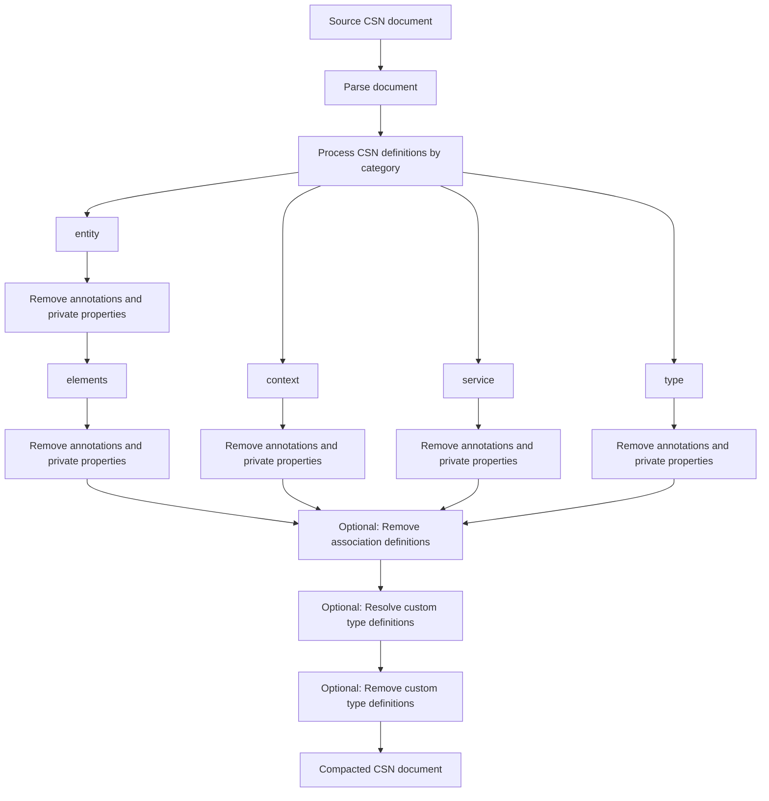

[](https://api.reuse.software/info/github.com/open-resource-discovery/metadata-compactor-golang)
[](https://github.com/open-resource-discovery/metadata-compactor-golang/actions/workflows/ci.yml)
[](https://github.com/open-resource-discovery/metadata-compactor-golang/releases/latest)

# Metadata Compactor Golang Library

Compact [Core Schema Notation](https://sap.github.io/csn-interop-specification/) JSON documents for AI friendly metadata exposure. The tool can remove annotations and private properties based on explicit rulesets, resolve selected attributes from custom types onto their elements, and remove custom type definitions.



## Requirements and Setup

Requires Go 1.26 or later.

### Installation

```sh
go get github.com/open-resource-discovery/metadata-compactor-golang
```

## Build

Build the command-line tool from the repository root:

```sh
go build -o metadata-compactor ./cmd
```

This creates a `metadata-compactor` executable in the current directory.

## Usage

```text
metadata-compactor -i <input.json> -r <rules.json> [-o <output.json>]
```

| Flag | Required | Description                                                                         |
| --- | --- |-------------------------------------------------------------------------------------|
| `-i` | Yes | Path to the CSN JSON document to compact.                                           |
| `-r` | Yes | Path to the JSON rules file.                                                        |
| `-o` | No | Path for the compacted CSN. When omitted, the result is written to standard output. |

For example, write the compacted document to a file:

```sh
./metadata-compactor -i resources/examples/airline.csn.json -r resources/examples/rules.json -o compacted.airline.csn.json
```

Or send it directly to another command:

```sh
./metadata-compactor -i input.airline.csn.json -r rules.json | jq .
```

### Running the tests

Run vet:

```sh
go vet -tags unit,integration ./...
```

Run tests:

```sh
# Run unit tests only
go test -tags unit ./...

# Run integration tests only
go test -tags integration ./...

# Run unit and integration tests together
go vet -tags unit,integration ./...
```

## Rules file

The rules file is a versioned CSN annotation allowlist. Its structure is defined by [the JSON Schema](resources/schemas/ruleset.schema.json).

```json
{
  "version": "0.1",
  "created_at": "2026-09-11T00:00:00Z",
  "description": "Example CSN rules",
  "csn": [
    "@EndUserText.label",
    "@PersonalData.*"
  ]
}
```

Each CSN rule is a string:

- An annotation / private property name retains only that exact element.
- A trailing `.*` retains an annotation / private property namespace and its children, such as `@PersonalData.*`.

Empty or omitted `csn` entries mean all annotations / private properties are removed.

## Compaction behavior

For every CSN `context`, `service`, and `entity` definition, the processor:

1. Removes annotations and private properties that are not explicitly allowed via a rule.
2. Applies the same procedure to entity elements.
3. Resolves supported attributes from referenced custom types onto entity elements.
4. Removes custom type definitions (`kind: "type"`) from the final document.

The original input is never modified; the command emits a compacted CSN JSON document with two-space indentation.

## Support, Feedback, Contributing

This project is open to feature requests/suggestions, bug reports etc. via [GitHub issues](https://github.com/open-resource-discovery/metadata-compactor-golang/issues). Contribution and feedback are encouraged and always welcome. For more information about how to contribute, the project structure, as well as additional contribution information, see our [Contribution Guidelines](https://github.com/open-resource-discovery/.github/blob/main/CONTRIBUTING.md).

## Security / Disclosure
If you find any bug that may be a security problem, please follow our instructions at [in our security policy](https://github.com/open-resource-discovery/.github/blob/main/SECURITY.md) on how to report it. Please do not create GitHub issues for security-related doubts or problems.

## Code of Conduct

We as members, contributors, and leaders pledge to make participation in our community a harassment-free experience for everyone. By participating in this project, you agree to abide by its [Code of Conduct](https://github.com/open-resource-discovery/.github/blob/main/CODE_OF_CONDUCT.md) at all times.

## Licensing

Copyright 2026 SAP SE or an SAP affiliate company and metadata-compactor-golang contributors. Please see our [LICENSE](LICENSE) for copyright and license information. Detailed information including third-party components and their licensing/copyright information is available [via the REUSE tool](https://api.reuse.software/info/github.com/open-resource-discovery/metadata-compactor-golang).
