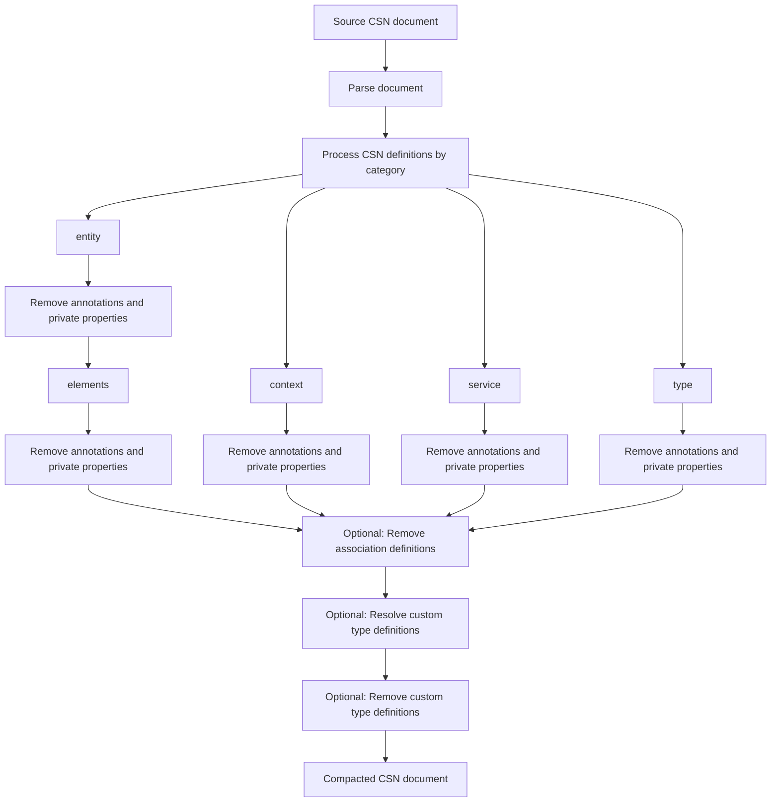

[](https://api.reuse.software/info/github.com/open-resource-discovery/metadata-compactor-golang)
[](https://github.com/open-resource-discovery/metadata-compactor-golang/actions/workflows/ci.yml)
[](https://github.com/open-resource-discovery/metadata-compactor-golang/releases/latest)

# Metadata Compactor Golang Library

Compact metadata documents for AI-friendly exposure. The library is designed to support multiple document formats; [Core Schema Notation](https://sap.github.io/csn-interop-specification/) (CSN) JSON is currently supported, with additional formats planned.

For CSN documents, rulesets and optional baseline documents control which annotations and private properties remain, and whether custom types and association elements are preserved.


```mermaid
flowchart TD
      A[Source CSN document] --> B[Parse document]
      B --> C[Process CSN definitions by category]

      C --> Ctx[context]
      C --> Svc[service]
      C --> Ent[entity]
      C --> Typ[type]

      Ctx --> CtxP[Remove annotations and private properties]
      Svc --> SvcP[Remove annotations and private properties]
      Ent --> EntP[Remove annotations and private properties]
      Typ --> TypP[Remove annotations and private properties]

      EntP --> Elem[elements]
      
      Elem --> ElemP[Remove annotations and private properties]
      
      ElemP --> AssocR["Optional: Remove association definitions"]
      CtxP --> AssocR
      SvcP --> AssocR
      TypP --> AssocR
      
      AssocR --> ElemR["Optional: Resolve custom type definitions"]

      ElemR --> TypR["Optional: Remove custom type definitions"]
      
      TypR --> O[Compacted CSN document]
```

## Requirements and Setup

Requires Go 1.26 or later.

### Installation

```sh
go get github.com/open-resource-discovery/metadata-compactor-golang
```

## Build

Build the command-line tool from the repository root:

```sh
go build -o metadata-compactor ./cmd/metadata-compactor
```

This creates a `metadata-compactor` executable in the current directory.

## CSN usage

```text
metadata-compactor -i <input.json> -r <rules.json> [-b <baseline.json>] [-o <output.json>]
```

| Flag | Required | Description |
| --- | --- | --- |
| `-i`, `--input` | Yes | Path to the CSN JSON document to compact. |
| `-r`, `--rules` | Yes | Path to the JSON rules file. |
| `-b`, `--baseline` | No | Path to a baseline CSN document from which path-specific preservation rules are derived. |
| `-o`, `--output` | No | Path for the compacted CSN. When omitted, the result is written to standard output. |

For example, write the compacted document to a file:

```sh
./metadata-compactor -i input.airline.csn.json -r rules.json -o compacted.airline.csn.json
```

Or send it directly to another command:

```sh
./metadata-compactor -i input.airline.csn.json -r rules.json | jq .
```

### Baseline-derived rules

A baseline is an existing CSN document whose annotations and private properties should continue to appear at the same locations in a newly compacted document. Supply it with `-b` or `--baseline`:

```sh
./metadata-compactor \
  -i current.airline.csn.json \
  -r rules.json \
  -b previous.airline.csn.json \
  -o compacted.airline.csn.json
```

For every annotation or private property in the baseline, the processor derives an exact rule containing both its name and its path. For example, this baseline fragment preserves `@EndUserText.label` only on `AirlineService.Airline`:

```json
{
  "definitions": {
    "AirlineService.Airline": {
      "kind": "entity",
      "@EndUserText.label": "Airline",
      "elements": {}
    }
  }
}
```

The same annotation on another definition or element is not preserved unless it is also present at that path in the baseline or is allowed by `csn.preserve`. Baseline-derived rules are combined with the configured ruleset; they do not replace it.

Only the presence and path of a property in the baseline matter. The processor does not copy properties or values from the baseline—it retains the corresponding property and its current value when that property exists in the input document. Structural options still apply, so type definitions and associations are removed unless their respective preservation options are enabled.

The Go API accepts multiple baseline documents and combines the rules derived from all of them:

```go
result := processor.Process(metadatafiltering.CSN, input, baselineA, baselineB)
```

### Running the tests

Run vet:

```sh
go vet -tags unit,integration ./...
```

Run tests:

```sh
# Run unit tests only
go test -tags unit ./...

# Run integration tests only
go test -tags integration ./...

# Run unit and integration tests together
go test -tags unit,integration ./...
```

## Rules file

The rules file is a versioned CSN compaction configuration. Its structure is defined by [the JSON Schema](resources/schemas/ruleset.schema.json).

```json
{
  "name": "Example Ruleset",
  "version": "0.1",
  "created_at": "2026-09-11T00:00:00Z",
  "description": "Example CSN rules",
  "csn": {
    "options": {
      "preserve_types": false,
      "preserve_associations": false
    },
    "preserve": [
      "@EndUserText.label",
      "@PersonalData.*",
      "__private"
    ]
  }
}
```

`csn.preserve` is an allowlist. Each entry is a string:

- An annotation / private property name retains only that exact element.
- A trailing `.*` retains an annotation / private property namespace and its children, such as `@PersonalData.*`.

An empty `preserve` list removes all annotations and private properties.

`csn.options` controls structural compaction:

- `preserve_types`: when `true`, retain custom `kind: "type"` definitions and leave element type references unchanged. When `false`, referenced custom-type attributes are resolved onto entity elements and type definitions are removed.
- `preserve_associations`: when `true`, retain elements whose type is `cds.Association`. When `false`, remove those elements.

Both options default to `false` when omitted by the Go JSON decoder; include them explicitly in rules files to conform to the JSON Schema.

## CSN compaction behavior

The processor:

1. Derives exact, path-specific rules from any supplied baseline documents.
2. Combines baseline-derived rules with the global `csn.preserve` allowlist.
3. Removes annotations and private properties not selected by either source from `context`, `service`, `entity`, and `type` definitions.
4. Applies the same pruning to entity elements.
5. Removes association elements unless `preserve_associations` is enabled.
6. Resolves supported attributes from referenced custom types and removes their definitions unless `preserve_types` is enabled.

The original input is never modified; the command writes a compacted JSON document to standard output or the path supplied with `-o`.

## Support, Feedback, Contributing

This project is open to feature requests/suggestions, bug reports etc. via [GitHub issues](https://github.com/open-resource-discovery/metadata-compactor-golang/issues). Contribution and feedback are encouraged and always welcome. For more information about how to contribute, the project structure, as well as additional contribution information, see our [Contribution Guidelines](https://github.com/open-resource-discovery/.github/blob/main/CONTRIBUTING.md).

## Security / Disclosure
If you find any bug that may be a security problem, please follow our instructions at [in our security policy](https://github.com/open-resource-discovery/.github/blob/main/SECURITY.md) on how to report it. Please do not create GitHub issues for security-related doubts or problems.

## Code of Conduct

We as members, contributors, and leaders pledge to make participation in our community a harassment-free experience for everyone. By participating in this project, you agree to abide by its [Code of Conduct](https://github.com/open-resource-discovery/.github/blob/main/CODE_OF_CONDUCT.md) at all times.

## Licensing

Copyright 2026 SAP SE or an SAP affiliate company and metadata-compactor-golang contributors. Please see our [LICENSE](LICENSE) for copyright and license information. Detailed information including third-party components and their licensing/copyright information is available [via the REUSE tool](https://api.reuse.software/info/github.com/open-resource-discovery/metadata-compactor-golang).
